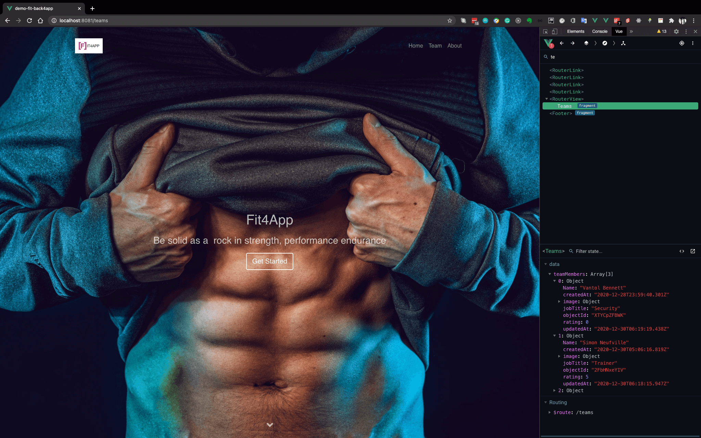

# demo-fit-back4app


Welcome to Fit4App. Built using Vue.js and a parse backend. This is just a demo application to see the connection between the parse backend and the Vue Framework.



## Project setup
```
npm install
```

### Compiles and hot-reloads for development
```
npm run serve
```

### Compiles and minifies for production
```
npm run build
```

### Lints and fixes files
```
npm run lint
```

### Customize configuration
See [Configuration Reference](https://cli.vuejs.org/config/).
